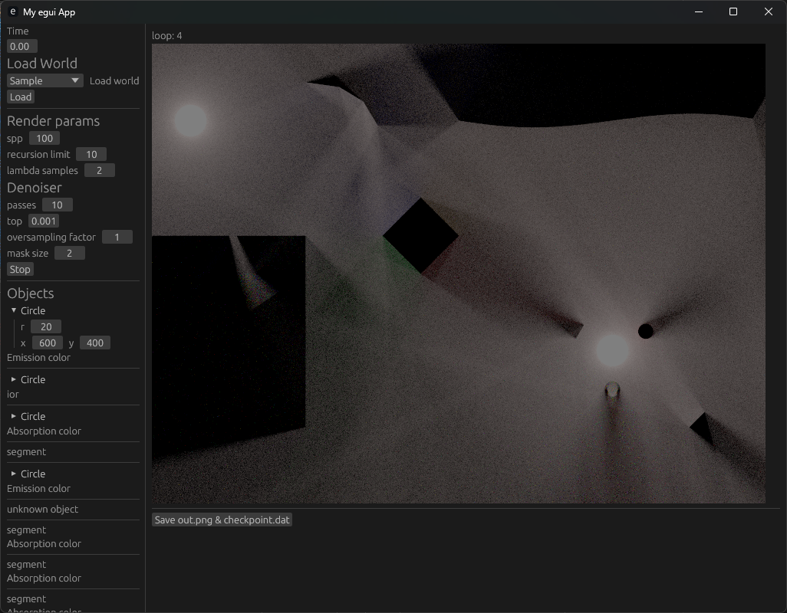
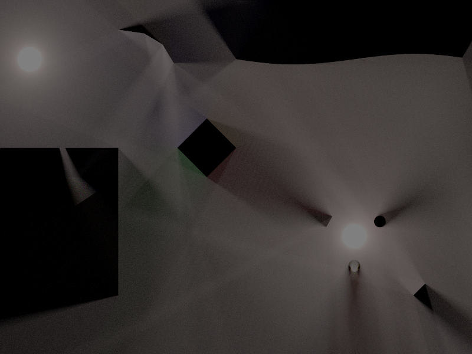
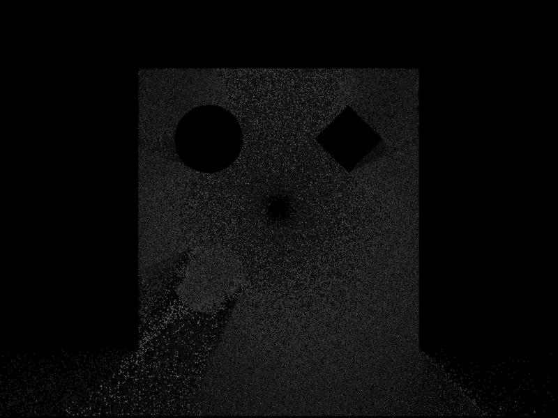
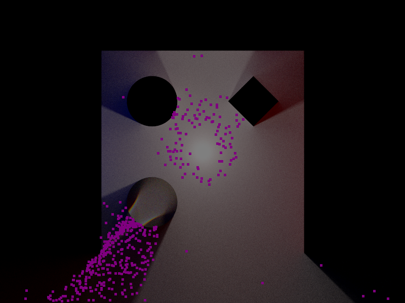
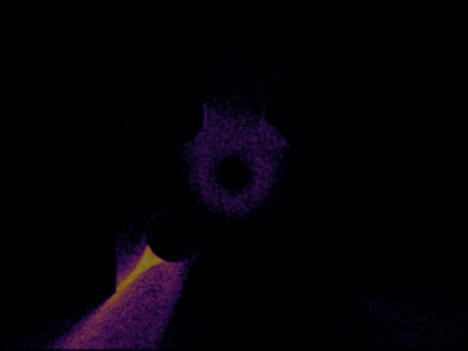
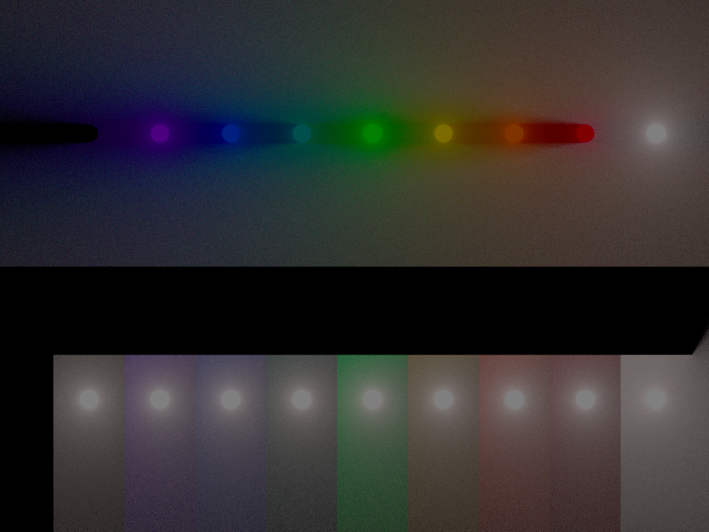
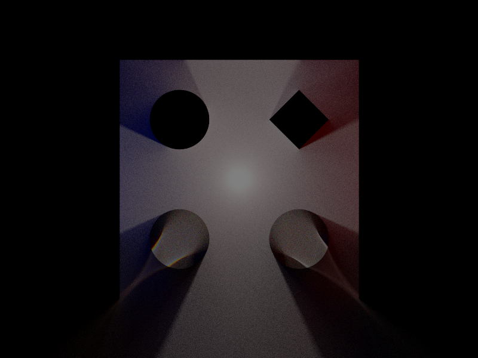

# What is it?
A 2D spectral raytracer, nearly functional

# Notes

Path tracing in production
https://jo.dreggn.org/path-tracing-in-production/2017/talk-jo/

Ray Tracing in One Weekend
https://raytracing.github.io/

Spectral Raytracing
https://graphics.cg.uni-saarland.de/courses/ris-2021/slides/Spectral%20Raytracing.pdf

# Gallery

Gui

Sample scene that can be animated. Featuring diffraction, bezier curves, mirrors...

Denoiser: computing difference between global image and current image

Denoiser: mask to select pixels to be recomputed

Denoiser: heatmap, the pixels with the most samples per pixel

Visible spectrum. Top: colored emission light. Bottom: white light + colored absorption box

 Dispersion test. Left [Cachy's equation](https://en.wikipedia.org/wiki/Cauchy%27s_equation) with dispersion. Right: Diffraction without dispersion.
 

Test scene with 200 spheres emission, absorption, diffraction. Probably faster some day with space partitioning

